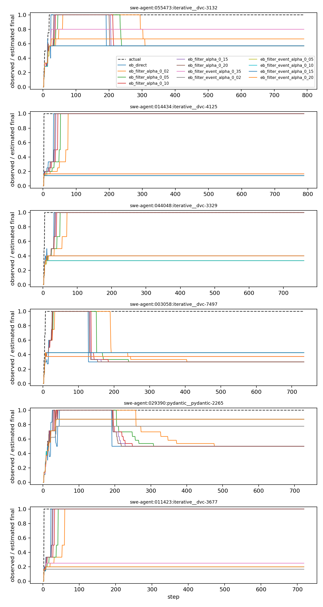

# Empirical-Bayes Filter Calibration

EB-only alpha and event-gated running-filter calibration pass.

## Split Summary

| source | train_traces | eval_traces | total_traces |
| --- | ---: | ---: | ---: |
| hermes | 6115 | 1529 | 7644 |
| swe-agent | 64028 | 16008 | 80036 |
| terminalbench | 5196 | 1299 | 6495 |

## Final-Work Summary

| variant | n | median_abs_error | median_interval80_width |
| --- | ---: | ---: | ---: |
| eb_direct | 917339 | 2.0 | 18.0 |
| eb_filter_alpha_0_02 | 917339 | 3.0 | 14.0 |
| eb_filter_alpha_0_05 | 917339 | 3.0 | 14.0 |
| eb_filter_alpha_0_10 | 917339 | 2.0 | 14.0 |
| eb_filter_alpha_0_15 | 917339 | 2.0 | 14.0 |
| eb_filter_alpha_0_20 | 917339 | 2.0 | 15.0 |
| eb_filter_event_alpha_0_35 | 917339 | 3.0 | 16.0 |
| eb_filter_event_alpha_0_02 | 917339 | 4.0 | 18.0 |
| eb_filter_event_alpha_0_05 | 917339 | 3.0 | 16.0 |
| eb_filter_event_alpha_0_10 | 917339 | 3.0 | 15.0 |
| eb_filter_event_alpha_0_15 | 917339 | 3.0 | 15.0 |
| eb_filter_event_alpha_0_20 | 917339 | 3.0 | 15.0 |

## Artifacts

- [Progress beliefs](progress_beliefs.csv)
- [Claim calibration pairs](belief_threshold_pairs.csv)
- [Belief summary](belief_summary.csv)

