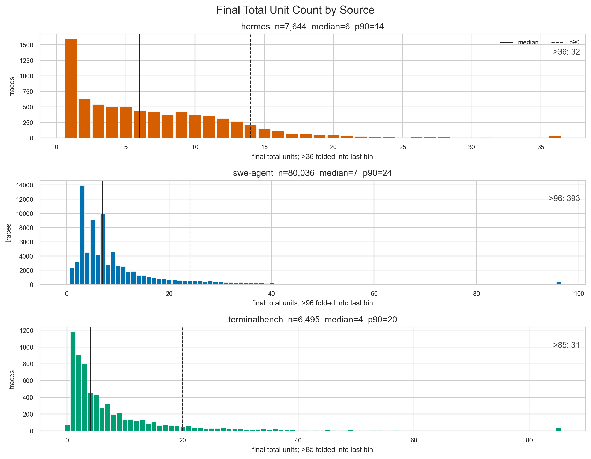
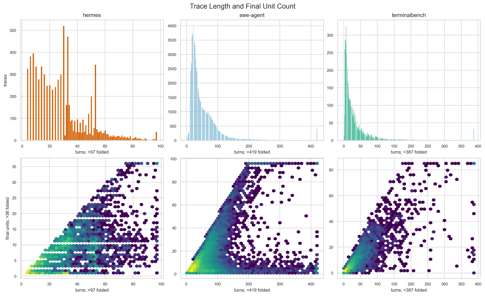
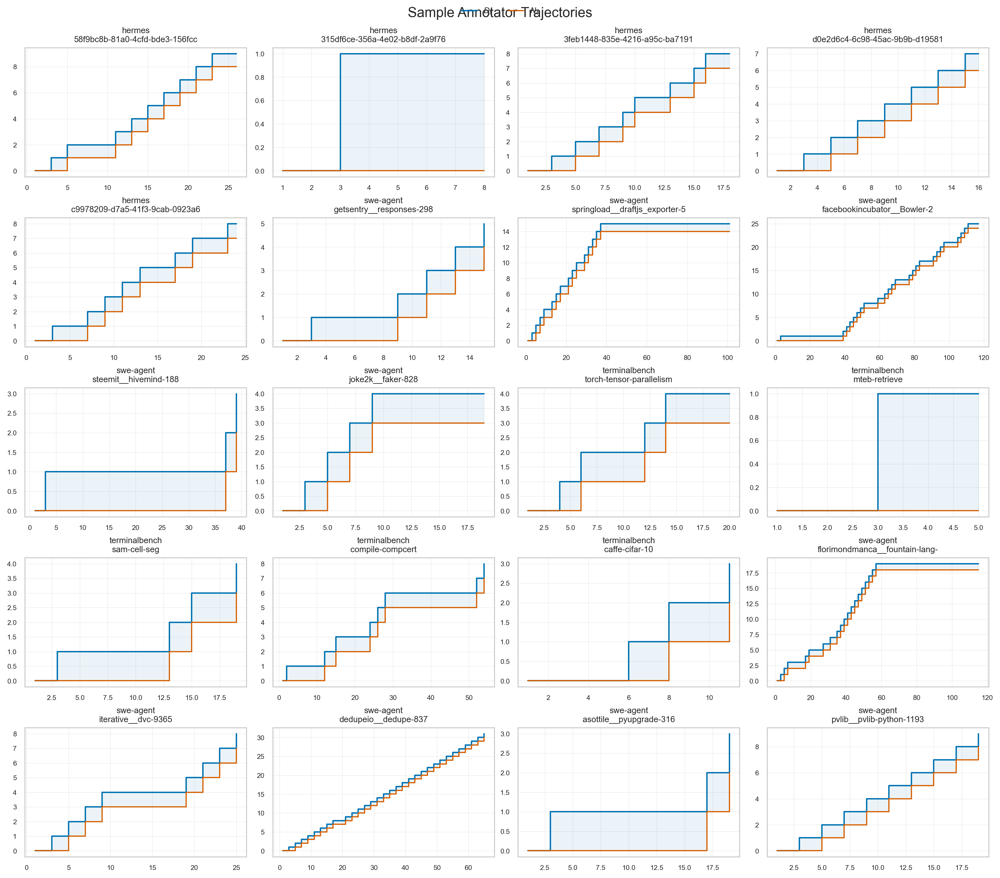
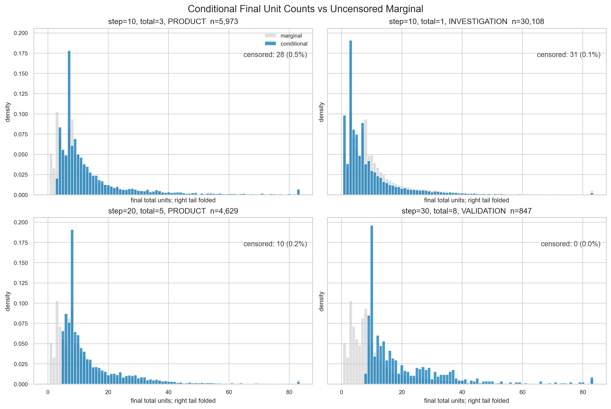
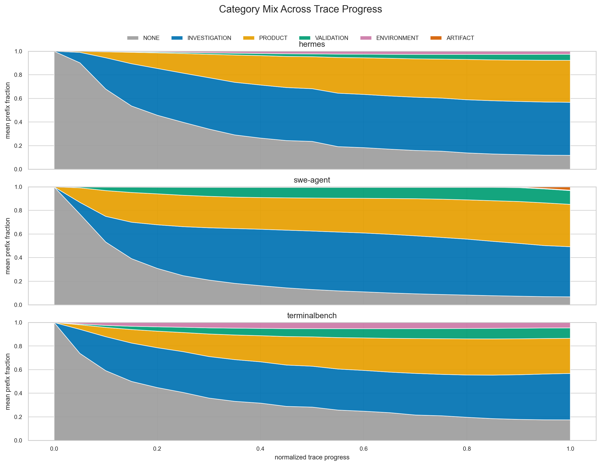

# Cached Annotator Diagnostic

This diagnostic runs the current annotator over every locally cached raw row and writes full local CSVs under ignored `observation-channel/data/diagnostics/cached_annotator/`. The committed files here are the report, plots, compact trace-level data, plot aggregates, conditional-prefix cohorts, and pathology candidates.

## Run Summary

- Raw rows scanned: 94,345
- Valid annotated traces: 94,175
- Local turn rows written: 4,769,485
- Parse/no-turn failures recorded: 170
- Critical pathology candidates: 170

### Source Summary

| source | traces | median_final_total | mean_final_total | p90_final_total | median_turns | stuck_rate |
| --- | --- | --- | --- | --- | --- | --- |
| hermes | 7644 | 6.000 | 7.087 | 14.000 | 28.000 | 0.000 |
| swe-agent | 80036 | 8.000 | 13.492 | 29.000 | 35.000 | 0.115 |
| terminalbench | 6495 | 4.000 | 8.731 | 20.000 | 18.000 | 0.046 |

The stuck predicate was tightened after inspecting 20 Hermes traces previously flagged as stuck. The triggering observation bodies were empty strings produced from structured tool acknowledgements/errors, not meaningful repeated output. The annotator now ignores repeated empty or short ack-like observations unless the body contains an explicit error marker or is non-trivial in length. With that repair, Hermes stuck flags drop from 5,525 traces to 2 traces.

## 1. Final Unit Count

Observed `D_T` is source-dependent. hermes: median 6.0, mean 7.1, p90 14.0; swe-agent: median 8.0, mean 13.5, p90 29.0; terminalbench: median 4.0, mean 8.7, p90 20.0.

## 2. Trace Length Versus Units

Trace length and final unit count are related but visibly not interchangeable. Long traces can still coalesce into modest unit counts, while compact traces can accumulate many units when actions switch category or target frequently.

## 3. Sample Trajectories

The sampled trajectories are a qualitative sanity check for monotone `D_t` and `N_t` behavior. Automated invariant failures, if any, are listed in `pathology_candidates.csv`.

## 4. Conditional Final Counts

The selected supported prefix cohorts have median IQR reduction of 10.0% versus the uncensored marginal `D_T` IQR (10.0). The plot excludes right-tail-censored SWE-Agent traces from the histograms and annotates the censored fraction for each cohort. This is a coarse signal check, not a trained estimator.

## 5. Category Mix

`NONE` is included for turns before any unit is open or where no current category exists. The plot is a prefix-level diagnostic, not a final taxonomy of trace work.

## Pathology Candidates

| rule | severity | count |
| --- | --- | --- |
| no_coalescing_every_action_new_unit | warning | 4436 |
| parse_error | critical | 170 |
| unexpected_terminal_category | warning | 21759 |
| very_long_stuck_continuation | warning | 924 |

The pathology log is automated only. Rows in `pathology_candidates.csv` are candidates for review, not human-confirmed annotation failures.

## Estimator Readiness

The supported prefix cohorts show visible signal for an estimator after excluding the censored SWE-Agent right tail, but the signal is still modest. Cautious go: use these tables to prototype an estimator, treat `swe-agent` traces with `final_total > 103` as right-censored or filter them from training, and inspect the automated pathology candidates first. The parse/critical-candidate affected trace rate is 0.18%.

## Right-Tail Censoring

The `swe-agent` `final_total > 103` folded tail contains 399 traces. Their exit statuses are 342 `submitted (exit_context)`, 16 `exit_context`, and 41 `early_exit`; 394 of the 399 are unsuccessful. This is consistent with a capped agent loop rather than ordinary completed trajectories. These traces are flagged in `trace_summary.csv` with `censored_right_tail=True` and summarized in `censoring_summary.csv`.

## Files

- `trace_summary.csv`: one compact row per raw trace, including parse errors.
- `final_total_distribution.csv`, `trace_length_distribution.csv`, `category_mix.csv`: plot-ready aggregates.
- `conditional_prefix_cohorts.csv`: all traces matching selected supported prefix states.
- `censoring_summary.csv`: exit-status breakdown for right-tail-censored traces.
- `pathology_candidates.csv`: automated sanity-check candidates.
- Local only: `observation-channel/data/diagnostics/cached_annotator/turns.csv` and `traces.csv`.
