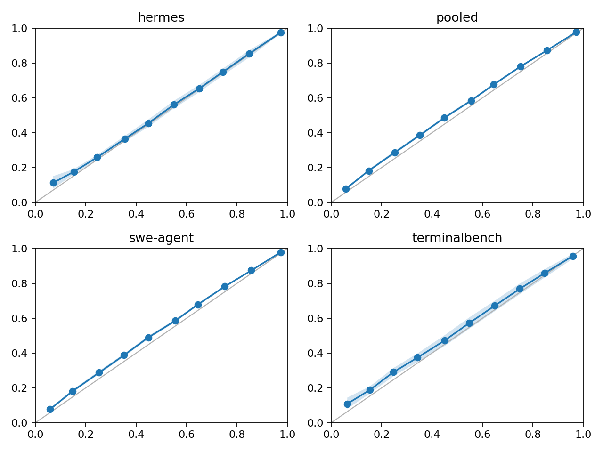
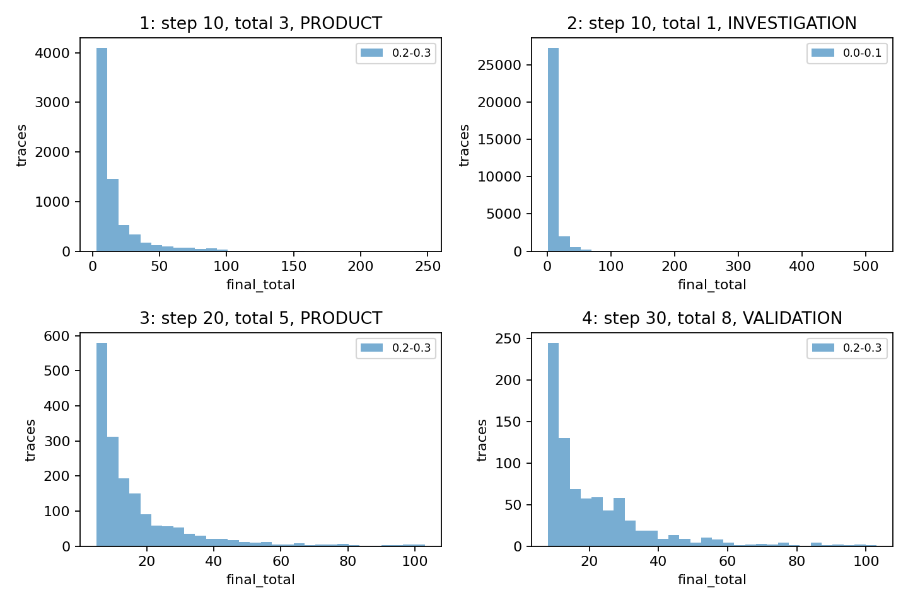
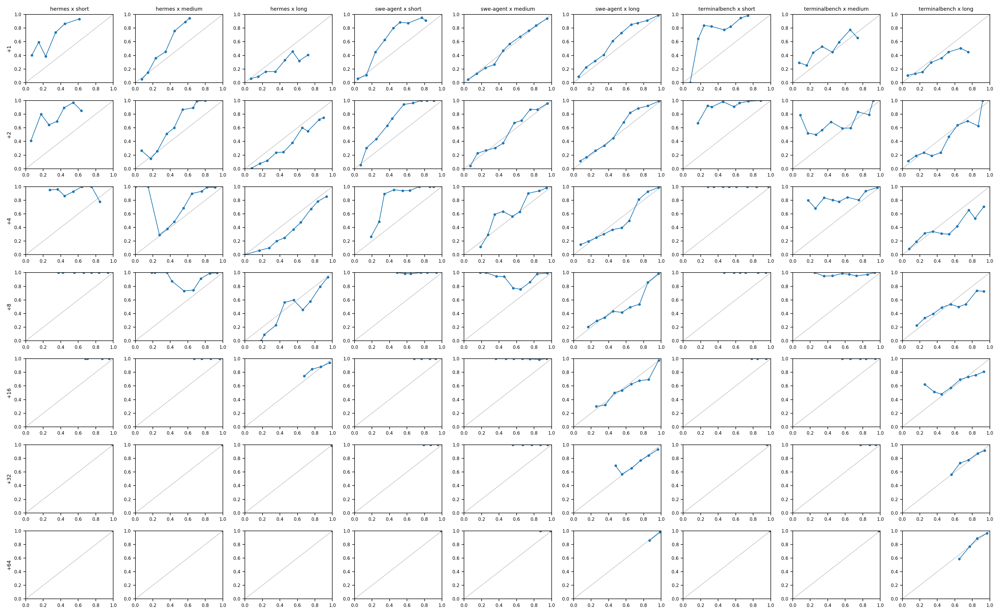
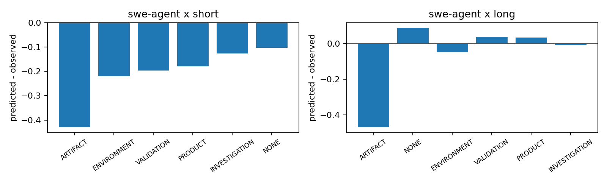
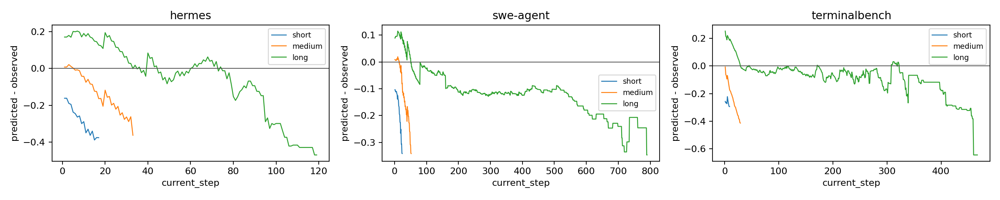

# Empirical Bayes v1

Trace-level bootstrap uses B=1000 and seed=1729.

## Split Summary

| source | train_traces | eval_traces | total_traces |
| --- | ---: | ---: | ---: |
| hermes | 6115 | 1529 | 7644 |
| swe-agent | 64028 | 16008 | 80036 |
| terminalbench | 5196 | 1299 | 6495 |

## Censored Eval Prefixes

| source | skipped_prefixes | skipped_with_prediction | long_tail_rate |
| --- | ---: | ---: | ---: |
| swe-agent | 20348 | 14886 | 0.7475480317076447 |

## Follow-up Diagnostics

