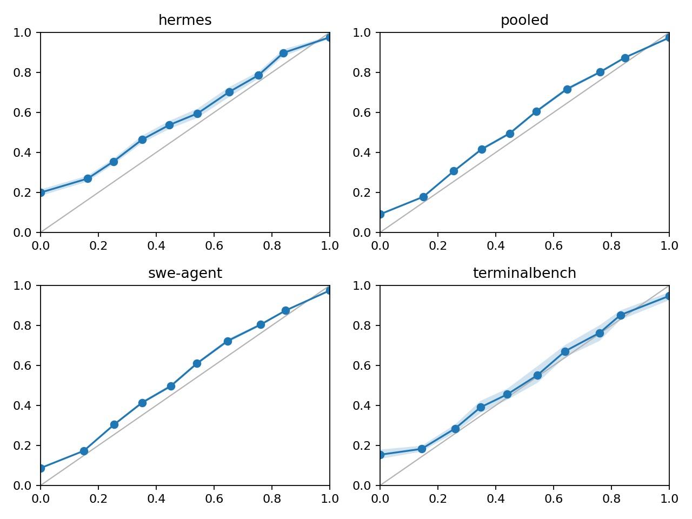
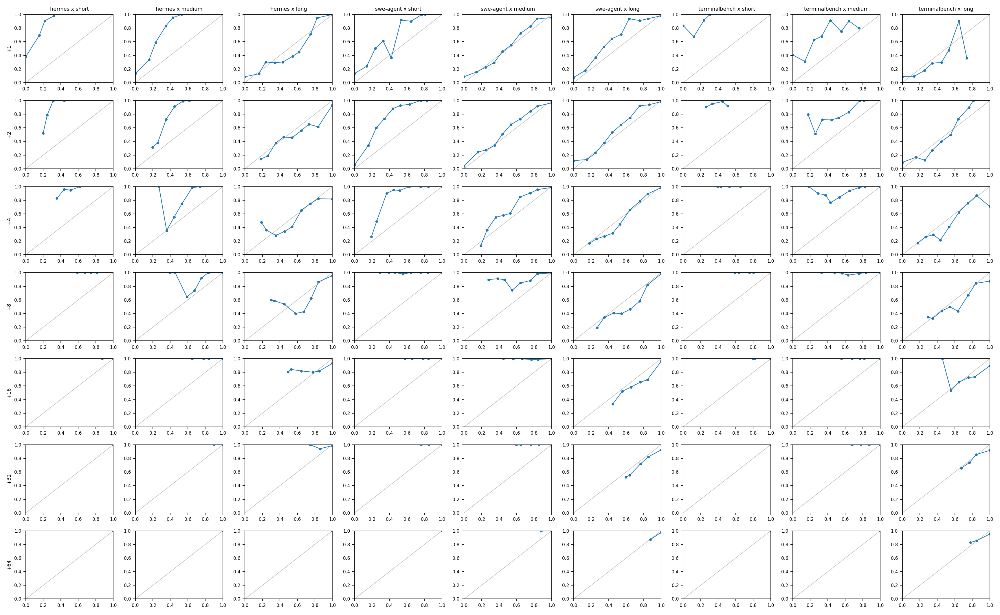
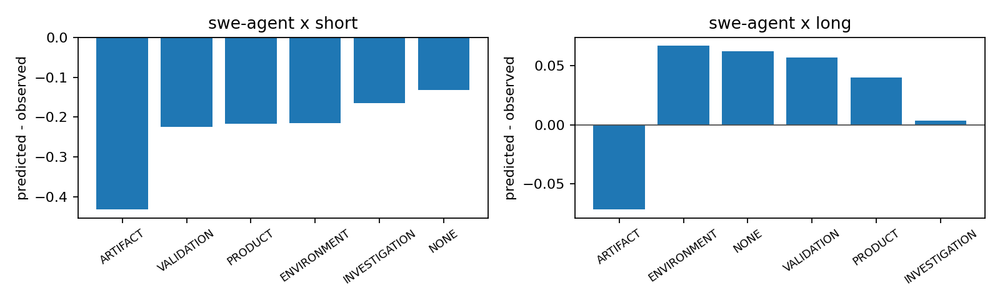
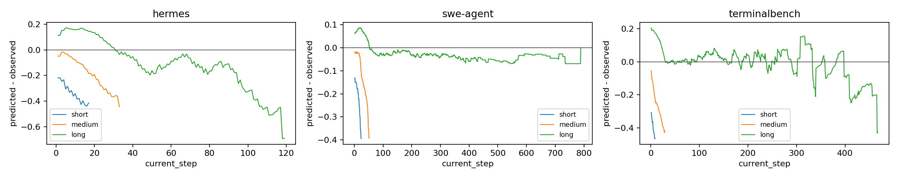
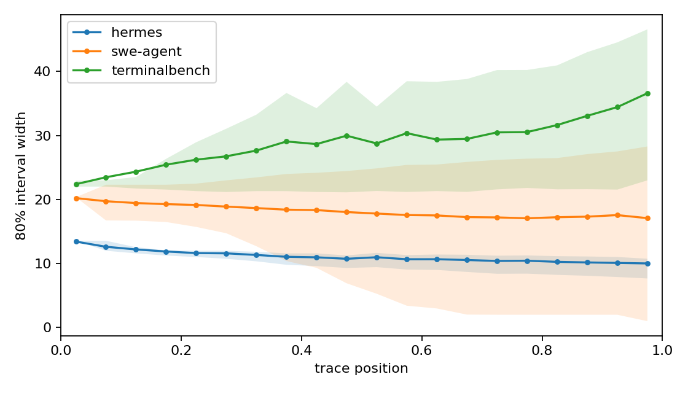
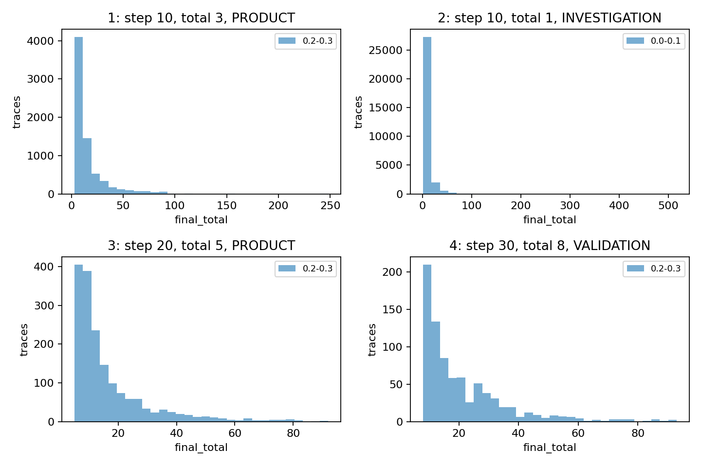
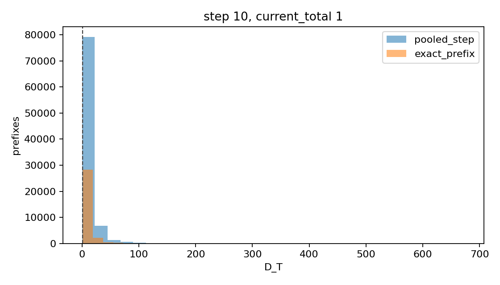

# GBM Quantile Trial

LightGBM quantile regressors evaluated through the v1.6 support gate.
Trace-level bootstrap uses B=1000 and seed=1729.

## Split Summary

| source | train_traces | eval_traces | total_traces |
| --- | ---: | ---: | ---: |
| hermes | 6115 | 1529 | 7644 |
| swe-agent | 64028 | 16008 | 80036 |
| terminalbench | 5196 | 1299 | 6495 |

## Censored Eval Prefixes

| source | skipped_prefixes | skipped_with_prediction | long_tail_rate |
| --- | ---: | ---: | ---: |
| swe-agent | 20348 | 14886 | 0.7475480317076447 |

## Quantile Crossing

| source | n | crossing_rate | mean_reordering_magnitude | p95_reordering_magnitude |
| --- | ---: | ---: | ---: | ---: |
| hermes | 44780 | 0.0927422956677088 | 0.26386186285110347 | 0.7809890928945418 |
| pooled | 917339 | 0.1985558228746407 | 0.09864963035005411 | 0.5886174292132624 |
| swe-agent | 828735 | 0.21207261669894478 | 0.09261125273948312 | 0.5743204166217684 |
| terminalbench | 43824 | 0.05106790799561884 | 0.26626828103755523 | 0.8830464622969234 |

[Quantile crossing summary](quantile_crossing_summary.csv)

## Follow-up Diagnostics

### Model-dependent diagnostics

### Shared v1.6 context diagnostics

These plots use the same cached corpus, split, conditional cohorts, and support diagnostics as v1.6; they are expected to match unless the input corpus changes.

[Failure feature distributions](failure_feature_distributions.csv)
